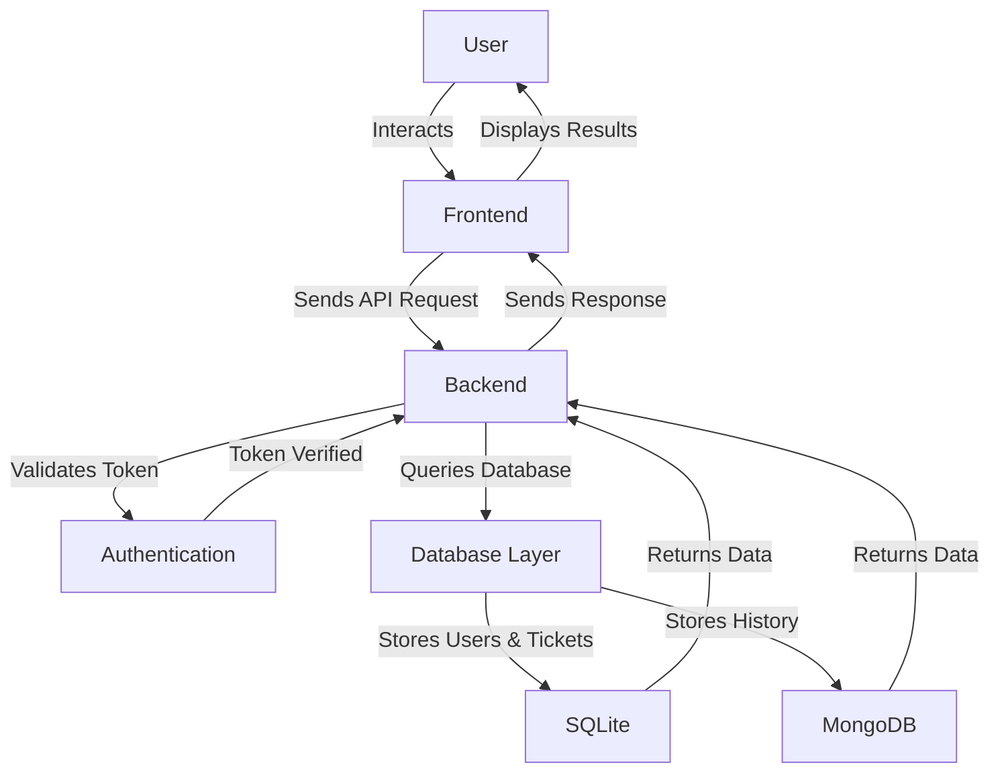

# 🎰 Loto Tracker API - Management and Calculation of Winnings - Portfolio 2025

<!-- 
[](https://github.com/SDINAHET/Loto-Tracker-API/actions)

[](https://github.com/SDINAHET/Loto-Tracker-API/actions)

[](https://github.com/SDINAHET/Loto-Tracker-API/blob/main/LICENSE)


 -->


### 📦 **Build et Couverture des Tests**
[](https://github.com/SDINAHET/Loto_API/releases)
[](https://github.com/SDINAHET/Loto_API/blob/main/LICENSE)

<!-- [](https://github.com/SDINAHET/Loto_API/actions) -->
<!-- [](https://github.com/SDINAHET/Loto_API/actions) -->
<!--  -->

<!--  -->
[](https://github.com/SDINAHET/Loto_API/actions)
[](https://codecov.io/gh/SDINAHET/Loto_API)
[](https://loto-api-black.vercel.app)

### 📊 **Statistiques du Projet**


<!--  -->
[](https://github.com/SDINAHET/Loto_API/issues)


### 🔗 **Liens Importants**
[](https://sdinahet.github.io/SDINAHET/Landing_page_loto_API.html)
[](http://localhost:8082/swagger-ui/index.html)
[](http://127.0.0.1:5500/)
[](https://github.com/SDINAHET/Loto_API/projects)
[](https://github.com/SDINAHET/Loto_API/discussions)
[](CHANGELOG.md)
[](CONTRIBUTING.md)
[](SECURITY.md)
[](CODE_OF_CONDUCT.md)
[](SUPPORT.md)
[](GITHUB_PACKAGE.md)
[](https://github.com/SDINAHET?tab=packages)
[](https://github.com/SDINAHET/Loto_API/packages)


<!-- [](https://github.com/SDINAHET/Loto_API/blob/main/SUPPORT.md) -->


<!-- [](README.md) -->
<!-- [](README-FR.md) -->
[](README.md#english-version)
[](README.md#version-française)
<!-- [](README.md#loto-api---gestion-et-calcul-des-gains) -->
<!-- # 🎰 Loto API - Gestion et Calcul des Gains -->
<!-- https://sdinahet.github.io/SDINAHET/Landing_page_loto_API.html  -->

# English version:

# 🎰 Loto Tracker API

## 📌 Table of Contents
1. [📌 Project Description](#-project-description)
2. [🏗️ Project Architecture](#-project-architecture)
3. [🚀 Key Features](#-key-features)
4. [🏗️ Installation & Configuration](#-installation--configuration)
   - [1️⃣ Prerequisites](#1️⃣-prerequisites)
   - [2️⃣ Clone the Project](#2️⃣-clone-the-project)
   - [3️⃣ Database Configuration](#3️⃣-database-configuration)
   - [4️⃣ Start the Backend (Spring Boot)](#4️⃣-start-the-backend-spring-boot)
   - [5️⃣ Start the Frontend](#5️⃣-start-the-frontend)
5. [🔗 API Endpoints](#-api-endpoints)
   - [📖 API Documentation](#-api-documentation)
   - [📌 Users](#-users)
   - [🎟️ Ticket Management](#-ticket-management)
   - [🎰 Draw Results](#-draw-results)
   - [🏆 Winnings Management](#-winnings-management)
   - [📊 Results History](#-results-history)
6. [📡 Deployment](#-deployment)
   - [📌 Deployment with Docker](#-deployment-with-docker)
7. [🚀 Roadmap & Future Improvements](#-roadmap--future-improvements)
8. [📜 Export Project Dependencies](#-export-project-dependencies)
9. [👨‍💻 Author & Contributions](#-author--contributions)
10. [📜 License](#-license)
11. [👥 Authors](#-authors)


## 📌 Project Description

**Loto API** is an application that allows users to manage their lottery tickets and automatically calculate their winnings by comparing their numbers with official results. The project includes a **secure API** with JWT authentication, a ticket management system, and a hybrid **SQL/NoSQL** database.

## 🏗️ Project Architecture

The application follows a **Full-Stack** architecture:

- **Frontend**: Simple web interface based on HTML, CSS, and JavaScript.
- **Backend**: REST API developed with **Spring Boot 3.4.2**.
- **Database**:
  - **SQLite**: Stores users and tickets.
  - **MongoDB**: Stores historical results.
- **Automation**: A script retrieves and updates draw results from source files.

## 🚀 Key Features

- ✔️ **User management** (Registration, Login, JWT Authentication).
- ✔️ **Ticket submission and management** (CRUD operations on tickets).
- ✔️ **Automatic calculation of winnings**.
- ✔️ **Historical results stored in MongoDB**.
- ✔️ **Visualization of results through charts**.
- ✔️ **Automatic updates of results via a script**.
- ✔️ **API endpoint security with Spring Security & JWT**.

## 🏗️ Installation & Configuration

### 1️⃣ Prerequisites

- [Java 21](https://www.oracle.com/java/technologies/javase/jdk21-archive-downloads.html)
- [Spring Boot 3.4.2](https://spring.io/projects/spring-boot)
- [SQLite 3.x](https://www.sqlite.org/download.html)
- [MongoDB](https://www.mongodb.com/try/download/community)
- [Node.js 18+](https://nodejs.org/)
- [Git](https://git-scm.com/)

### 2️⃣ Clone the Project
```bash
git clone https://github.com/SDINAHET/Loto_API.git
cd Loto_API
```

### 3️⃣ Database Configuration

#### SQLite (Users & Tickets)

Configure `application.properties`:
```properties
spring.datasource.url=jdbc:sqlite:loto.db
spring.datasource.driver-class-name=org.sqlite.JDBC
spring.datasource.username=
spring.datasource.password=
spring.datasource.hikari.maximum-pool-size=5
```

#### MongoDB (Draw Results)
Start MongoDB and configure `application.properties`:
```properties
spring.data.mongodb.uri=mongodb://localhost:27017/loto_results
```

### 4️⃣ Start the Backend (Spring Boot)
```bash
mvn install
mvn spring-boot:run
```
The API is available at `http://localhost:8082/swagger-ui/index.html`

### 5️⃣ Start the Frontend
The web interface can be served using **Live Server** on VSCode. Open `index.html` and start Live Server to access `http://127.0.0.1:5500/src/main/resources/static/index.html`.

```bash
npm install -g http-server
http-server src/main/resources/static -p 5500
http-server src/main/resources/static -p 5500 -a 0.0.0.0
```
Available front on:
  http://127.0.0.1:5500
---

## 🔗 API Endpoints

### 📖 Documentation API
🔗 **Swagger UI** : [see API doc](http://localhost:8082/swagger-ui/index.html)

### 📌 Users
| Method | Endpoint | Description |
|--------|---------|-------------|
| POST | `/api/users/register` | User registration |
| POST | `/api/auth/login3` | Login and JWT generation |
| GET  | `/api/auth/me` | Retrieve user info |
| GET  | `/api/auth/me/firstname` | Retrieve user's first name |
| POST | `/api/auth/logout` | Logout (JWT deletion) |
| GET  | `/api/users` | Retrieve list of users (Admin only) |
| GET  | `/api/users/{id}` | Retrieve a user's details |
| DELETE | `/api/users/{id}` | Delete a user (Admin only) |
| PUT | `/api/users/{id}` | Update user information |

### 🎟️ Ticket Management
| Method | Endpoint | Description |
|--------|---------|-------------|
| POST | `/api/tickets` | Add a ticket |
| GET | `/api/tickets` | List user tickets |
| GET | `/api/tickets/{id}` | Ticket details |
| DELETE | `/api/tickets/{id}` | Delete a ticket |
| PUT | `/api/tickets/{id}` | Modify a ticket |

### 🎰 Draw Results
| Method | Endpoint | Description |
|--------|---------|-------------|
| GET | `/api/tirages` | List all draws |
| GET | `/api/tirages/dates` | Retrieve available draw dates |
| GET | `/api/tirages?startDate={}&endDate={}` | Draws between two dates |

### 🏆 Winnings Management
| Method | Endpoint | Description |
|--------|---------|-------------|
| GET | `/api/gains/calculate` | Calculate ticket winnings |
| GET | `/api/gains` | Retrieve recorded winnings |
| GET | `/api/gains/{ticketId}` | Details of a ticket's winnings |

### 📊 Results History
| Method | Endpoint | Description |
|--------|---------|-------------|
| GET | `/api/historique/last20` | Retrieve the last 20 results |
| GET | `/api/historique/last20/Detail/tirage/{date}` | Details of a draw by date |
| GET | `/api/historique/last20/Detail/tirages?startDate={}&endDate={}` | History between two dates |

---

## 📡 Deployment
The project can be deployed on **Alwaysdata, AWS, or a VPS** using Docker.

### 📌 Deployment with Docker
Create `Dockerfile.backend` for the backend at the root of the project:
```dockerfile
# Use a lightweight Java 21 image
FROM openjdk:21-jdk-slim

# Set the working directory
WORKDIR /app

# Copy backend files
COPY . /app

# Execution permissions
RUN chmod +x mvnw

# Build the application
RUN ./mvnw install

# Run the application
CMD ["./mvnw", "spring-boot:run"]

# Expose the API port
EXPOSE 8082
```

Create Dockerfile.frontend for the frontend at the root of the project:
```dockerfile
# Use a lightweight Node.js image
FROM node:18-alpine

# Install http-server globally
RUN npm install -g http-server

# Set the working directory
WORKDIR /app

# Copy frontend files
COPY src/main/resources/static /app

# Expose port 5500
EXPOSE 5500

# Start the HTTP server
CMD ["http-server", "-p", "5500"]
```

Create a `docker-compose.yml` file to orchestrate the application:
```yaml
version: "3.8"

services:
  backend:
    build:
      context: .
      dockerfile: Dockerfile.backend
    ports:
      - "8082:8082"
    depends_on:
      - mongodb
    environment:
      SPRING_DATA_MONGODB_URI: mongodb://mongodb:27017/loto_database  # No authentication required

  frontend:
    build:
      context: .
      dockerfile: Dockerfile.frontend
    ports:
      - "5500:5500"
    depends_on:
      - backend

  mongodb:
    image: mongo:latest
    container_name: mongodb
    restart: always
    ports:
      - "27017:27017"
    environment:
      MONGO_INITDB_DATABASE: loto_database  # Sets the default database
    volumes:
      - mongodb_data:/data/db
      # - ./mongo-init.js:/docker-entrypoint-initdb.d/mongo-init.js:ro  # Ensure this file exists

volumes:
  mongodb_data:

```
Start the containers:
```bash
docker-compose up -d --build
http-server src/main/resources/static -p 5500
```
Then open your browser at http://127.0.0.1:5500/ to access the frontend
and for the backend (Swagger): http://localhost:8082/swagger-ui/index.html.

📌 Explanation:
up -d → Starts the containers in the background (detached mode).
--build → Forces Docker to rebuild the images.

To stop the Docker services, run:
```bash
docker-compose down -v
```

If you want to remove all images and associated volumes:
```bash
docker-compose down --rmi all --volumes
```


Guide for the instalation of Docker package on Github for the project Loto_API: [GITHUB_PACKAGE.md](GITHUB_PACKAGE.md)

---

## 🚀 Roadmap & Future Improvements
- ✔️ **Addition of advanced analysis on results**
- ✔️ **Support for new games (Euromillions, Keno, etc.)**
- ✔️ **Notifications for winning results**
<!-- - ✔️ **Addition of a premium mode with advanced features** -->

---

## Export Project Dependencies - Spring Boot

### 🚀 Export Dependencies using Maven
To export all dependencies from a **Maven** project to a text file, use the following command:

```sh
mvn dependency:list > dependencies.txt
```
## 📜 [Licence](LICENSE)
Project under **MIT License** - Free to use and modify.

---

🎉 **Thank you for using Loto API!** Good luck 🍀

---

## 👨‍💻 Author & Contributions
Developed by [@SDINAHET](https://github.com/SDINAHET)
Contributions are welcome! Open an issue or submit a PR 🚀

👥 [Authors](AUTHORS.md)

<table>
  <tr>
    <td align="center">
      <a href="https://github.com/SDINAHET">
        <br />
        <sub><b>Stéphane Dinahet</b></sub>
      </a>
      <br />
      🚀 Creator & Lead Developer
    </td>
  </tr>
</table>


# Version française:

# 🎰 Loto API - Gestion et Calcul des Gains

## 📌 Table des Matières
1. [📌 Description du Projet](#-description-du-projet)
2. [🏗️ Architecture du Projet](#-architecture-du-projet)
3. [🚀 Fonctionnalités Principales](#-fonctionnalités-principales)
4. [🏗️ Installation & Configuration](#-installation--configuration)
   - [1️⃣ Prérequis](#1️⃣-prérequis)
   - [2️⃣ Cloner le Projet](#2️⃣-cloner-le-projet)
   - [3️⃣ Configuration de la Base de Données](#3️⃣-configuration-de-la-base-de-données)
   - [4️⃣ Lancer le Backend (Spring Boot)](#4️⃣-lancer-le-backend-spring-boot)
   - [5️⃣ Lancer le Frontend](#5️⃣-lancer-le-frontend)
5. [🔗 Endpoints de l'API](#-endpoints-de-lapi)
   - [📖 Documentation API](#-documentation-api)
   - [📌 Gestion des Utilisateurs](#-gestion-des-utilisateurs)
   - [🎟️ Gestion des Tickets](#-gestion-des-tickets)
   - [🎰 Résultats des Tirages](#-résultats-des-tirages)
   - [🏆 Gestion des Gains](#-gestion-des-gains)
   - [📊 Historique des Résultats](#-historique-des-résultats)
6. [📡 Déploiement](#-déploiement)
   - [📌 Déploiement avec Docker](#-déploiement-avec-docker)
7. [🚀 Roadmap & Améliorations Futures](#-roadmap--améliorations-futures)
8. [📜 Export des Dépendances du Projet](#-export-des-dépendances-du-projet)
9. [👨‍💻 Auteur & Contributions](#-auteur--contributions)
10. [📜 Licence](#-licence)
11. [👥 Auteurs](#-auteurs)

## 📌 Description du Projet

**Loto API** est une application permettant aux utilisateurs de gérer leurs tickets de loterie et de calculer automatiquement leurs gains en comparant leurs numéros avec les résultats officiels. Le projet inclut une **API sécurisée** avec authentification JWT, un système de gestion des tickets et une base de données hybride **SQL/NoSQL**.

## 🏗️ Architecture du Projet

L'application suit une architecture **Full-Stack** :

- **Frontend** : Interface web simple basée sur HTML, CSS et JavaScript.
- **Backend** : API REST développée avec **Spring Boot 3.4.2**.
- **Base de données** :
  - **SQLite** : Stockage des utilisateurs et des tickets.
  - **MongoDB** : Stockage des résultats historiques.
- **Automatisation** : Un script récupère et met à jour les résultats des tirages à partir des fichiers sources.

## 🚀 Fonctionnalités Principales

- ✔️ **Gestion des utilisateurs** (Inscription, Connexion, Authentification JWT).
- ✔️ **Soumission et gestion des tickets** (CRUD des tickets).
- ✔️ **Calcul automatique des gains**.
- ✔️ **Historique des résultats enregistrés en MongoDB**.
- ✔️ **Visualisation des résultats sous forme de graphiques**.
- ✔️ **Mise à jour automatique des résultats via un script**.
- ✔️ **Sécurisation des endpoints API avec Spring Security & JWT**.

## 🏗️ Installation & Configuration

### 1️⃣ Prérequis

- [Java 21](https://www.oracle.com/java/technologies/javase/jdk21-archive-downloads.html)
- [Spring Boot 3.4.2](https://spring.io/projects/spring-boot)
- [SQLite 3.x](https://www.sqlite.org/download.html)
- [MongoDB](https://www.mongodb.com/try/download/community)
- [Node.js 18+](https://nodejs.org/)
- [Git](https://git-scm.com/)

### 2️⃣ Cloner le projet
```bash
git clone https://github.com/SDINAHET/Loto_API.git
cd Loto_API
```

### 3️⃣ Configuration de la base de données

#### SQLite (Utilisateurs & Tickets)

Configurer `application.properties` :
```properties
spring.datasource.url=jdbc:sqlite:loto.db
spring.datasource.driver-class-name=org.sqlite.JDBC
spring.datasource.username=
spring.datasource.password=
spring.datasource.hikari.maximum-pool-size=5
```

#### MongoDB (Résultats des tirages)
Démarrer MongoDB et configurer `application.properties` :
```properties
spring.data.mongodb.uri=mongodb://localhost:27017/loto_results
```

python3 run.py

### 4️⃣ Lancer le Backend (Spring Boot)
```bash
mvn install spring-boot:run
```
L'API est disponible sur `http://localhost:8082/swagger-ui/index.html`

### 5️⃣ Lancer le Frontend
L'interface web peut être servie via **Live Server** sur VSCode. Ouvrir `index.html` et démarrer Live Server pour accéder à `http://127.0.0.1:5500/src/main/resources/static/index.html`.

```bash
npm install -g http-server
http-server src/main/resources/static -p 5500
http-server src/main/resources/static -p 5500 -a 0.0.0.0
```
Available front on:
  http://127.0.0.1:5500

http-server → Lance un serveur HTTP statique.
src/main/resources/static → Définit le dossier contenant les fichiers à servir.
-p 5500 → Spécifie que le serveur doit écouter sur le port 5500 comme live server
---

## 🔗 Endpoints de l'API

### 📖 Documentation API
🔗 **Swagger UI** : [Voir la doc API](http://localhost:8082/swagger-ui/index.html)

### 📌 Utilisateurs
| Méthode | Endpoint | Description |
|---------|---------|-------------|
| POST | `/api/users/register` | Inscription utilisateur |
| POST | `/api/auth/login3` | Connexion et génération du JWT |
| GET  | `/api/auth/me` | Récupération des infos utilisateur |
| GET  | `/api/auth/me/firstname` | Récupérer le prénom de l'utilisateur |
| POST | `/api/auth/logout` | Déconnexion (suppression du JWT) |
| GET  | `/api/users` | Récupération de la liste des utilisateurs (Admin uniquement) |
| GET  | `/api/users/{id}` | Récupération des informations d’un utilisateur |
| DELETE | `/api/users/{id}` | Suppression d’un utilisateur (Admin uniquement) |
| PUT | `/api/users/{id}` | Mise à jour des informations utilisateur |

### 🎟️ Gestion des Tickets
| Méthode | Endpoint | Description |
|---------|---------|-------------|
| POST | `/api/tickets` | Ajouter un ticket |
| GET | `/api/tickets` | Lister les tickets de l'utilisateur |
| GET | `/api/tickets/{id}` | Détails d’un ticket |
| DELETE | `/api/tickets/{id}` | Supprimer un ticket |
| PUT | `/api/tickets/{id}` | Modifier un ticket |

### 🎰 Résultats des tirages
| Méthode | Endpoint | Description |
|---------|---------|-------------|
| GET | `/api/tirages` | Lister tous les tirages |
| GET | `/api/tirages/dates` | Récupérer les dates des tirages disponibles |
| GET | `/api/tirages?startDate={}&endDate={}` | Tirages entre deux dates |

### 🏆 Gestion des Gains
| Méthode | Endpoint | Description |
|---------|---------|-------------|
| GET | `/api/gains/calculate` | Calculer les gains des tickets |
| GET | `/api/gains` | Récupérer les gains enregistrés |
| GET | `/api/gains/{ticketId}` | Détails des gains d'un ticket |

### 📊 Historique des résultats
| Méthode | Endpoint | Description |
|---------|---------|-------------|
| GET | `/api/historique/last20` | Récupérer les 6 derniers résultats de l'historique des résultats officiel |
| GET | `/api/historique/last20/Detail/tirage/{date}` | Détails d’un tirage par date |
| GET | `/api/historique/last20/Detail/tirages?startDate={}&endDate={}` | Historique entre deux dates |

---

## 📡 Déploiement
Le projet peut être déployé sur **Alwaysdata, AWS ou un VPS** avec Docker.

### 📌 Déploiement avec Docker
Créer un `Dockerfile.backend` pour le backend à la racine du projet :
```dockerfile
# Utiliser une image Java 21 légère
FROM openjdk:21-jdk-slim

# Définir le répertoire de travail
WORKDIR /app

# Copier les fichiers du backend
COPY . /app

# Permission d'execution
RUN chmod +x mvnw

# Construire l'application
RUN ./mvnw install

# Exécuter l'application
CMD ["./mvnw", "spring-boot:run"]

# Exposer le port de l'API
EXPOSE 8082
```

Créer un `Dockerfile.frontend` pour le frontend à la racine du projet :
```dockerfile
# Utiliser une image Node.js légère
FROM node:18-alpine

# Installer http-server globalement
RUN npm install -g http-server

# Définir le répertoire de travail
WORKDIR /app

# Copier les fichiers du frontend
COPY src/main/resources/static /app

# Exposer le port 5500
EXPOSE 5500

# Lancer le serveur HTTP
CMD ["http-server", "-p", "5500"]
```

Créer un fichier `docker-compose.yml` pour orchestrer l'application :
```yaml
version: "3.8"

services:
  backend:
    build:
      context: .
      dockerfile: Dockerfile.backend
    ports:
      - "8082:8082"
    depends_on:
      - mongodb
    environment:
      SPRING_DATA_MONGODB_URI: mongodb://mongodb:27017/loto_database  # Suppression de l'authentification

  frontend:
    build:
      context: .
      dockerfile: Dockerfile.frontend
    ports:
      - "5500:5500"
    depends_on:
      - backend

  mongodb:
    image: mongo:latest
    container_name: mongodb
    restart: always
    ports:
      - "27017:27017"
    environment:
      MONGO_INITDB_DATABASE: loto_database  # Définit la base de données par défaut
    volumes:
      - mongodb_data:/data/db
      # - ./mongo-init.js:/docker-entrypoint-initdb.d/mongo-init.js:ro  # Vérifie que ce fichier existe bien

volumes:
  mongodb_data:

```
Lancer les conteneurs :
```bash
docker-compose up -d --build
http-server src/main/resources/static -p 5500
```
puis ouvrir votre navigateur à l'adresse `http://127.0.0.1:5500/` pour accéder au frontend
et pour le backend (swagger):`http://localhost:8082/swagger-ui/index.html`.

📌 Explication :
up -d → Démarre les conteneurs en arrière-plan (mode détaché).
--build → Force la reconstruction des images Docker.

Quand tu veux arrêter les services docker, exécute :
```bash
docker-compose down -v
```

Si tu veux supprimer toutes les images et volumes associés :
```bash
docker-compose down --rmi all --volumes
```

Guide pour l'installation des package Docker sur Github pour le projet Loto_API: [GITHUB_PACKAGE.md](GITHUB_PACKAGE.md)

---

## 🚀 Roadmap & Améliorations Futures
- ✔️ **Ajout d’analyses avancées sur les résultats**
- ✔️ **Support de nouveaux jeux (Euromillions, Keno, etc.)**
- ✔️ **Notifications push ou email pour les résultats officiel**

---

## Export Project Dependencies - Spring Boot

### 🚀 Export Dependencies using Maven
To export all dependencies from a **Maven** project to a text file, use the following command:

```sh
mvn dependency:list > dependencies.txt
```

---

## 📜 [Licence](LICENSE)
Projet sous licence **MIT** - Libre d'utilisation et de modification.

---

🎉 **Merci d'utiliser Loto API !** Bonne chance 🍀

---

## 👨‍💻 Auteur & Contributions
Développé par [@SDINAHET](https://github.com/SDINAHET)
Contributions bienvenues ! Ouvrez une issue ou proposez une PR 🚀

👥 [Auteurs](AUTHORS.md)

<table>
  <tr>
    <td align="center">
      <a href="https://github.com/SDINAHET">
        <br />
        <sub><b>Stéphane Dinahet</b></sub>
      </a>
      <br />
      🚀 Creator & Lead Developer
    </td>
  </tr>
</table>




https://status.stephanedinahet.fr/status/loto

http://stephanedinahet.fr
https://stephanedinahet.fr