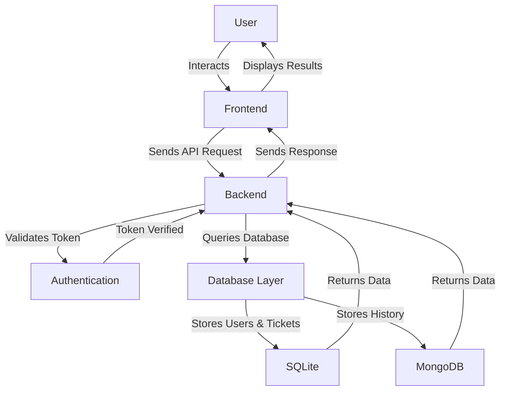

```mermaid
flowchart TD
    A[User] -->|Interacts| B[Frontend]
    B -->|Sends API Request| C[Backend]

    C -->|Validates Token| D[Authentication]
    D -->|Token Verified| C

    C -->|Queries Database| E[Database Layer]
    E -->|Stores Users & Tickets| F[SQLite]
    E -->|Stores History| G[MongoDB]

    F -->|Returns Data| C
    G -->|Returns Data| C
    C -->|Sends Response| B
    B -->|Displays Results| A

```